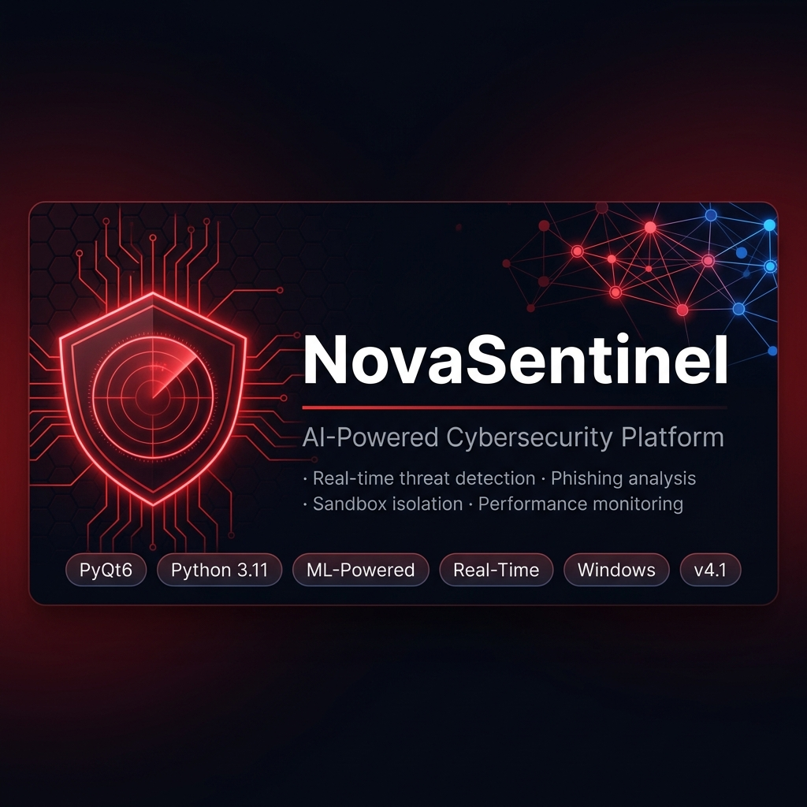

<p align="center">
  
</p>

<p align="center">
  
  
  
  
  
  
  
</p>

<p align="center">
  <a href="CHANGELOG.md">📋 Changelog</a> &nbsp;·&nbsp;
  <a href="SECURITY.md">🔒 Security Policy</a> &nbsp;·&nbsp;
  <a href="CONTRIBUTING.md">🤝 Contributing</a> &nbsp;·&nbsp;
  <a href="https://github.com/Chandu-BG/SentinelCore/releases">📦 Releases</a>
</p>

---

# NovaSentinel

**NovaSentinel** is a production-quality, AI-powered cybersecurity desktop application for Windows. It combines real-time threat detection, machine learning anomaly analysis, sandbox isolation, phishing intelligence, and an interactive AI security analyst into a single, standalone platform — no Python installation required.

> Built for security professionals, researchers, and privacy-conscious users who demand serious protection without relying on cloud dependencies.

---

## ✨ Features

### Core Protection Modules

| Module | Description |
|--------|-------------|
| 🛡️ **Dashboard** | Real-time security overview with CPU/RAM/Disk/Network metrics, threat feed, and AI analyst chatbot |
| 🔍 **Scan Engine** | Quick, Full, Smart, and Custom directory scans with YARA + ML + hash verification |
| 🌐 **Phishing Intelligence** | URL analysis with entropy scoring, heuristic pattern matching, and AI explanation |
| 🧪 **Sandbox Analyzer** | Safe behavioral analysis of suspicious files in isolated environment |
| 📦 **Quarantine Vault** | AES-256 encrypted isolation vault — restore or permanently delete threats |
| ⚡ **Performance Monitor** | Live process table with CPU/GPU/memory per-process, safe process termination |
| 📋 **Logs** | Full structured audit log with severity levels and timestamps |
| 📱 **Application Audit** | Installed application scanner with risk scoring and permission analysis |
| ⚙️ **Settings** | Theme selection, permission management, engine configuration |

### Security Engines

| Engine | Technology |
|--------|-----------|
| **AI Engine** | scikit-learn IsolationForest anomaly detection with self-learning |
| **File Engine** | Watchdog real-time file system monitoring + ransomware detection |
| **Hash Engine** | SHA-256 integrity verification + dynamic identity hashing |
| **Risk Engine** | Composite weighted risk score (0–100) with adaptive threat level |
| **Trust Engine** | Per-process adaptive trust scoring with behavior history |
| **Network Detector** | Suspicious connection monitoring and IP blocking via Windows Firewall |
| **Injection Detector** | Process injection pattern detection (DLL injection, shellcode) |
| **Defense Engine** | Automated threat response: process kill, IP block, quarantine |
| **Self-Protection** | Platform integrity monitoring — detects tampering with NovaSentinel itself |
| **Auto-Correction** | Self-healing: restores corrupted DB, config, and ML models automatically |
| **Browser Protection** | Real-time URL monitoring in browser processes |

### AI Assistant

NovaSentinel includes a built-in **SOC Analyst AI** powered by Ollama (local LLM, no cloud required):
- Answers questions about detected threats, quarantined files, process anomalies
- Explains phishing URL analysis results in plain English
- Can execute commands: quarantine all threats, start quick scan, terminate suspicious processes
- Fully offline — your data never leaves the device

---

## 📸 Screenshots

<p align="center">
  <i>Dashboard — Real-time security metrics and AI analyst chatbot</i>
</p>

> The application uses the **Crimson Night** dark theme by default. Five additional themes are available in Settings.
> Launch the app (`python main.py`) to see the full interface.

---

## 🚀 Quick Start

### Option A — Pre-built Windows EXE (Recommended)

1. Download `NovaSentinel-v4.1-Windows.zip` from the [**Releases**](https://github.com/Chandu-BG/SentinelCore/releases) page
2. Extract the zip to any folder
3. Double-click `NovaSentinel.exe`
4. **No Python required** — all dependencies bundled

> **Note:** Windows Defender may show a SmartScreen warning on first launch (unsigned binary). Click "More info → Run anyway" to proceed. This is normal for unsigned community software.

### Option B — Run from Source

**Requirements:**
- Windows 10/11 (64-bit)
- Python 3.11+
- Administrator privileges recommended (for process termination & firewall rules)

```bash
# 1. Clone the repository
git clone https://github.com/Chandu-BG/SentinelCore.git
cd SentinelCore

# 2. Create virtual environment (recommended)
python -m venv .venv
.venv\Scripts\activate

# 3. Install dependencies
pip install -r requirements.txt

# 4. Run the application
python main.py
```

### Optional: Ollama AI Backend

To enable the AI analyst chatbot:

```bash
# Install Ollama from https://ollama.com
# Then pull any supported model via the Ollama CLI
```

NovaSentinel auto-detects Ollama on startup. Without Ollama, the AI assistant operates in offline mode with a built-in local report generator — all analysis still works.

---

## 🔨 Build from Source (Create Windows EXE)

```bash
# 1. Install build dependency
pip install pyinstaller

# 2. Run the production build script
build_production.bat
```

The script will:
- Generate all branding assets
- Clean previous builds and log files
- Run PyInstaller with the optimized spec
- Remove any stray files from the output
- Print a size report (target: < 500 MB)

**Output:** `dist\NovaSentinel\NovaSentinel.exe`

**System Requirements for Build:**
- Python 3.11+
- All packages from `requirements.txt` installed
- ~2 GB free disk space during build
- Build time: 5–15 minutes depending on hardware

---

## 🏛️ Architecture Overview

```
┌─────────────────────────────────────────────────────────────────────┐
│                        NovaSentinel                                 │
│                      PyQt6 Desktop Application                      │
├────────────────────────────┬────────────────────────────────────────┤
│          GUI Layer         │           Core Layer                   │
│  ┌─────────────────────┐  │  ┌─────────────────────────────────┐  │
│  │    MainWindow       │  │  │        SecurityCore             │  │
│  │  QStackedWidget     │◄─┼──│   Central Orchestrator          │  │
│  │  + 9 Views          │  │  │   starts/stops all engines      │  │
│  └──────────┬──────────┘  │  └──────────────┬──────────────────┘  │
│             │              │                 │                       │
│  ┌──────────▼──────────┐  │  ┌──────────────▼──────────────────┐  │
│  │    CoreBridge        │  │  │         35 Engines              │  │
│  │  pyqtSignal relay   │◄─┼──│  AI · File · Phishing · YARA    │  │
│  │  thread-safe emit   │  │  │  Sandbox · Network · Ransom     │  │
│  └─────────────────────┘  │  │  Trust · Risk · Defense · ...   │  │
│                            │  └──────────────┬──────────────────┘  │
│  ┌─────────────────────┐  │                 │                       │
│  │  TelemetryManager   │  │  ┌──────────────▼──────────────────┐  │
│  │  MetricsBar         │  │  │     ProcessManager              │  │
│  │  CoreBridge metrics │  │  │     QuarantineManager           │  │
│  │  loop (2 s / adapt) │  │  │     SystemScanner               │  │
│  └─────────────────────┘  │  │     RealtimeMonitor (watchdog)  │  │
│                            │  └─────────────────────────────────┘  │
└────────────────────────────┴────────────────────────────────────────┘
                               │
              ┌────────────────▼──────────────────┐
              │       Data Layer                   │
              │  SQLite DB · AES Vault · ML Models │
              │  YARA Rules · Config · Theme QSS   │
              └───────────────────────────────────┘
```

**Key design decisions:**
- All heavy operations run in **background threads** — the UI event loop is never blocked
- CoreBridge uses `pyqtSignal` for thread-safe UI updates (emit-from-thread, process-on-main)
- `SecurityCore` is a singleton orchestrator — all engines share the same instance
- `TelemetryManager` is an append-only in-memory log with a 2-second polling loop

---

## 🗺️ Project Structure

```
NovaSentinel/
├── main.py                     # Application entry point
├── requirements.txt            # Python dependencies
├── NovaSentinel.spec           # PyInstaller build configuration
├── build_production.bat        # Windows production build script
├── LICENSE                     # MIT License
├── RELEASE_NOTES.md            # Version history and changelog
│
├── assets/                     # Branding resources
│   ├── novasentinel.ico        # App icon (multi-resolution)
│   ├── novasentinel.png        # Main logo (512×512)
│   ├── splash.png              # Splash screen
│   └── github_banner.png      # Repository banner
│
├── gui/                        # PyQt6 user interface
│   ├── app.py                  # Application bootstrap + splash screen
│   ├── main_window.py          # Main window orchestrator
│   ├── core_bridge.py          # Thread-safe signals between core and UI
│   ├── theme_manager.py        # 6 themes with QSS token substitution
│   ├── views/                  # Individual module screens
│   │   ├── dashboard_view.py
│   │   ├── scan_view.py
│   │   ├── phishing_view.py
│   │   ├── quarantine_view.py
│   │   ├── performance_view.py
│   │   ├── logs_view.py
│   │   └── settings_view.py
│   └── widgets/                # Reusable UI components
│       ├── splash_screen.py    # Animated startup splash
│       ├── sidebar.py
│       ├── metrics_bar.py
│       ├── notification_toast.py
│       └── ai_assistant_widget.py
│
├── core/                       # Core infrastructure managers
│   ├── security_core.py        # Central orchestrator (SecurityCore)
│   ├── telemetry_manager.py    # System metrics collection
│   ├── process_manager.py      # Process listing + termination
│   ├── quarantine_manager.py   # Quarantine vault management
│   ├── realtime_monitor.py     # File system watchdog
│   ├── exception_handler.py    # Crash recovery + watchdog
│   └── ...
│
├── engines/                    # Security detection engines (35 modules)
│   ├── novasentinel_engine.py  # AI assistant core (Ollama integration)
│   ├── ai_engine.py            # ML anomaly detection
│   ├── file_engine.py          # File scanning + quarantine
│   ├── phishing_detector.py    # URL phishing analysis
│   ├── sandbox_engine.py       # Behavioral sandbox
│   ├── ransomware_detector.py  # Ransomware pattern detection
│   ├── network_detector.py     # Network threat monitoring
│   └── ...
│
├── database/                   # SQLite schema and helpers
│   └── init_db.py
│
├── config/                     # Runtime configuration
│   ├── version.json            # App settings + theme persistence
│   └── themes/                 # QSS theme files
│
├── scripts/                    # Utility scripts
│   └── generate_assets.py      # Branding asset generator
│
└── tests/                      # Test suite
    └── test_system.py
```

---

## 🎨 Themes

NovaSentinel includes 6 built-in UI themes:

| Theme | Description |
|-------|-------------|
| **Crimson Night** *(default)* | Deep black + red — high-contrast security aesthetic |
| **Cyber Blue** | Dark navy + electric blue — classic security terminal |
| **Emerald Dark** | GitHub-dark + emerald green — developer-friendly |
| **Royal Purple** | Deep space + purple — for the discerning analyst |
| **Graphite Gray** | Pure minimal dark — distraction-free monitoring |
| **Minimal Light** | Light mode — for bright environments |

Switch themes via Settings → Theme or the sidebar dropdown.

---

## 🔒 Security Notes

- **IP Blocking** requires Windows Administrator rights (netsh firewall rules)
- **Process Termination** may require admin rights for system/protected processes
- **Quarantine Vault** uses AES-256-CBC with PBKDF2-HMAC-SHA256 (480,000 iterations)
- **AI Engine** trains exclusively on local data — no data leaves the device
- **Ollama AI** runs entirely locally — no API keys, no cloud
- **Auto-Correction** will recreate a corrupted database (historical data may be lost)

---

## 🛠️ Technologies Used

| Technology | Version | Purpose |
|-----------|---------|---------|
| Python | 3.11+ | Runtime |
| PyQt6 | 6.6+ | GUI framework |
| pyqtgraph | 0.13+ | Real-time performance graphs |
| scikit-learn | 1.3+ | ML anomaly detection |
| YARA-Python | 4.3+ | Malware signature matching |
| pefile | 2023+ | PE file analysis |
| cryptography | 41+ | AES-256 encryption vault |
| watchdog | 3.0+ | File system monitoring |
| psutil | 5.9+ | System & process metrics |
| requests | 2.31+ | HTTP client (Ollama API) |
| wmi | 1.5+ | Windows Management Instrumentation |
| PyInstaller | 6+ | Desktop packaging |
| Pillow | 12+ | Asset generation |
| SQLite3 | stdlib | Threat database |

---

## 🗺️ Future Enhancements

- [ ] Scheduled automatic scans (daily/weekly)
- [ ] Email/webhook alerts for critical threats
- [ ] Custom YARA rule import
- [ ] Cloud threat intelligence feed integration
- [ ] Multi-user support with role-based access
- [ ] Windows Event Log integration
- [ ] Network packet capture and analysis
- [ ] macOS/Linux port (partial support already exists)
- [ ] Installer package (Inno Setup / NSIS)
- [ ] Digital code signing for SmartScreen bypass

---

## 🤝 Contributing

See [CONTRIBUTING.md](CONTRIBUTING.md) for full guidelines.

```bash
# Fork → Clone → Branch → Commit → Pull Request
git clone https://github.com/Chandu-BG/SentinelCore.git
git checkout -b feature/your-feature-name

# Run the test suite
pip install pytest pytest-timeout hypothesis
pytest tests/ -v
```

---

## 📄 License

This project is licensed under the **MIT License** — see [LICENSE](LICENSE) for details.

---

<p align="center">
  Made with ❤️ for the security community
  <br/>
  <b>NovaSentinel Security © 2026</b>
</p>
