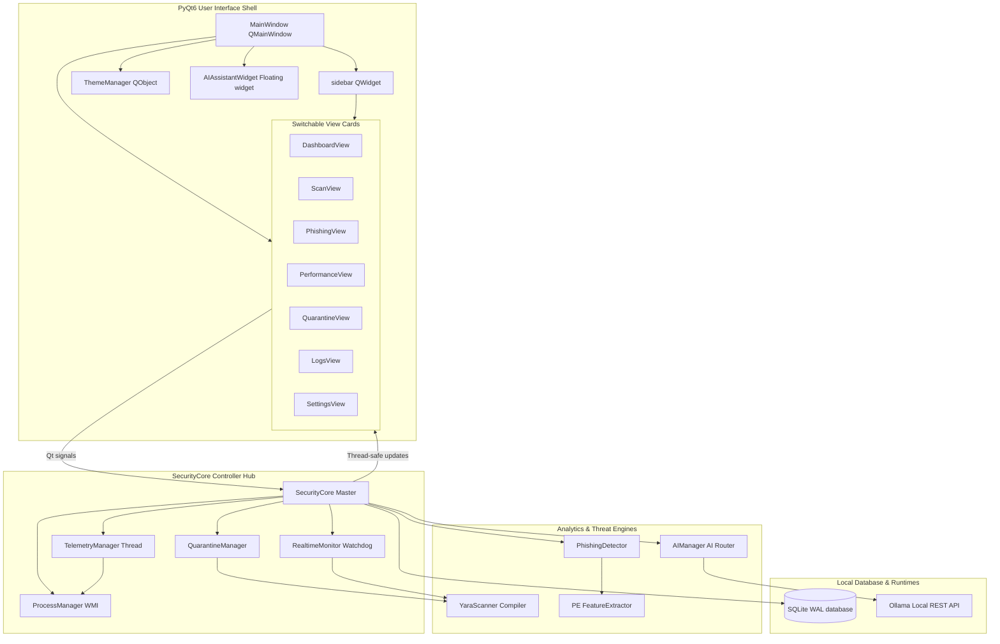
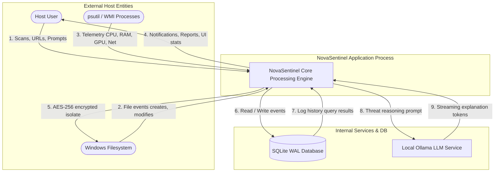
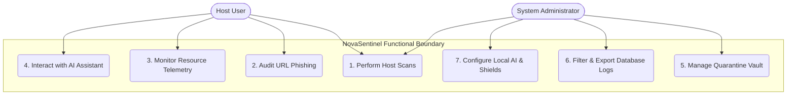

# NovaSentinel: System Architecture & UML Diagrams

This document compiles the core system architecture, data flows, use cases, and database schemas of the **NovaSentinel** cognitive cybersecurity suite. All diagrams are fully represented using standard, syntax-valid **Mermaid UML** blocks, which automatically render inside compatible Markdown viewers.

---

## 1. System Architecture Diagram

This diagram represents the decoupled, multi-layered block architecture of the NovaSentinel host application, separating the PyQt6 user interface views, the background SecurityCore controller, the engine analyzers, and the local storage/AI back-ends.



---

## 2. Data Flow Diagram (DFD Level 0)

Renders the high-level data streams, inputs, and outputs between external entities (the User and the Windows Host System) and the central NovaSentinel process, highlighting how threat analysis and telemetry reports are stored.



---

## 3. Use Case Diagram

Exposes how the Host User and the System Administrator interact with the individual functional boundaries and setting overrides of NovaSentinel.



---

## 4. Entity-Relationship Diagram (ERD)

Highlights the attributes, structural datatypes, primary keys, check constraints, and relationships of the six SQLite database tables that manage system persistence.

```mermaid
erDiagram
    threat_log {
        integer id PK "AUTOINCREMENT"
        text threat_type NOT_NULL "Category of Threat"
        text description NOT_NULL "Explainability Detail"
        text severity CHECK_IN "low, medium, high, critical"
        text timestamp NOT_NULL "ISO 8601 UTC"
        text file_path NULLABLE "Affected File or URL"
    }
    process_trust {
        text process_name PK "Executable Name"
        integer trust_score DEFAULT_100 "Safety score [0-100]"
        text last_seen NOT_NULL "ISO 8601 UTC"
    }
    blocked_ips {
        integer id PK "AUTOINCREMENT"
        text ip_address UNIQUE "Target IP Address"
        text reason NOT_NULL "Explainability Detail"
        text blocked_at NOT_NULL "ISO 8601 UTC"
    }
    risk_history {
        integer id PK "AUTOINCREMENT"
        text category NOT_NULL "Module Categorization"
        integer score NOT_NULL "Risk score [0-100]"
        text timestamp NOT_NULL "ISO 8601 UTC"
    }
    file_events {
        integer id PK "AUTOINCREMENT"
        text file_path NOT_NULL "Absolute File Path"
        text event_type NOT_NULL "created, modified, deleted"
        text timestamp NOT_NULL "ISO 8601 UTC"
    }
    system_events {
        integer id PK "AUTOINCREMENT"
        text event_type NOT_NULL "System category toggled"
        text description NOT_NULL "Action explanation details"
        text severity NOT_NULL "INFO, WARNING, ERROR"
        text timestamp NOT_NULL "ISO 8601 UTC"
    }

    %% Visual logical relationships mapping database correlations
    threat_log }o--|| file_events : triggers
    system_events }o--|| threat_log : audits
```
